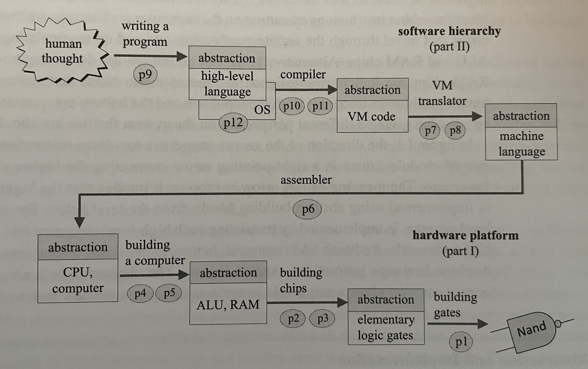

# The Elements of Computing Systems (Nand2Tetris)

_Building a Modern Computer from First Principles
By Noam Nisan & Shimon Shocken_
---

This project is to document my journey of creating a computer system from the ground up as I work through the different sections of **The Elements of Computing Systems** (second edition) book.

## Resources:
- Book: https://mitpress.mit.edu/books/elements-computing-systems-second-edition
- Website: https://www.nand2tetris.org/
- Digital HDL Tools: 
  - https://github.com/hneemann/Digital
  - https://github.com/SebLague/Digital-Logic-Sim
- Nand2Tetris VS Code Plugin: https://marketplace.visualstudio.com/items?itemName=Throvn.nand2tetris

### Helper Commands
### Sections 1, 2, & 3
- Running the Hardware Simulator
  - `sh tools/HardwareSimulator.sh`
- Running the Digital HDL project (https://github.com/hneemann/Digital):
  - Clone the repo and build the jar
  - From root of `Digital` project, build the jar via `mvn package`
  - Run jar via IntelliJ or from root of Digital project via `java -jar target/Digital.jar`
### Section 4
  - Running the CPU Emulator
    - `sh tools/CPUEmulator.sh`
### Section 6
  - Running the Assembler
    - `sh tools/Assembler.sh`
  - Running the CPU Emulator
    - `sh tools/CPUEmulator.sh`

## Contents
### Hardware
- [X] [Boolean Logic](./notes/01-boolean-logic.md)
- [X] [Boolean Arithmetic](./notes/02-boolean-arithmetic.md)
- [X] [Memory](./notes/03-memory.md)
- [X] [Machine Language](./notes/04-machine-language.md)
- [X] [Computer Architecture](./notes/05-computer-architecture.md)
- [ ] [Assembler](./notes/06-assembler.md)

### Software
- [ ] [Virtual Machine I - Processing](./notes/07-virtual-machine-processing.md)
- [ ] [Virtual Machine II - Control](./notes/08-virtual-machine-control.md)
- [ ] [High-Level Language](./notes/09-high-level-language.md)
- [ ] [Compiler I - Syntax Analysis](./notes/10-compiler-syntax-analysis.md)
- [ ] [Compiler II - Code Generation](./notes/11-compiler-code-generation.md)
- [ ] [Operating System](./notes/12-operating-system.md)