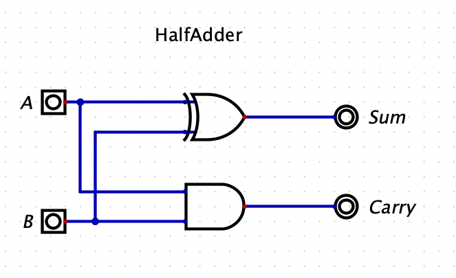
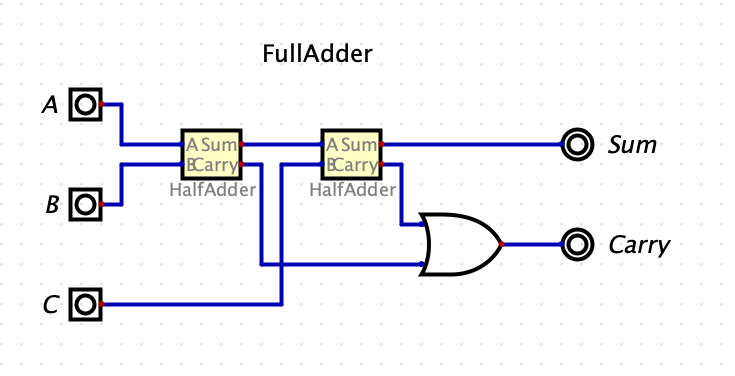
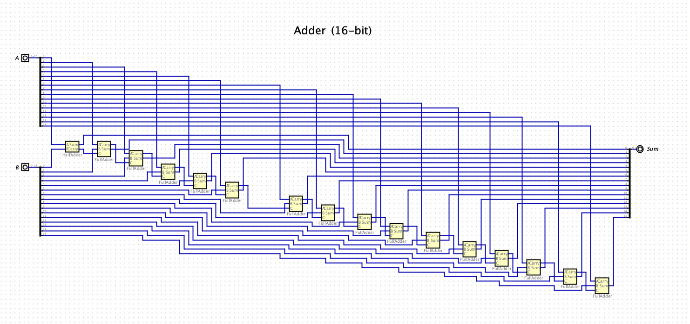
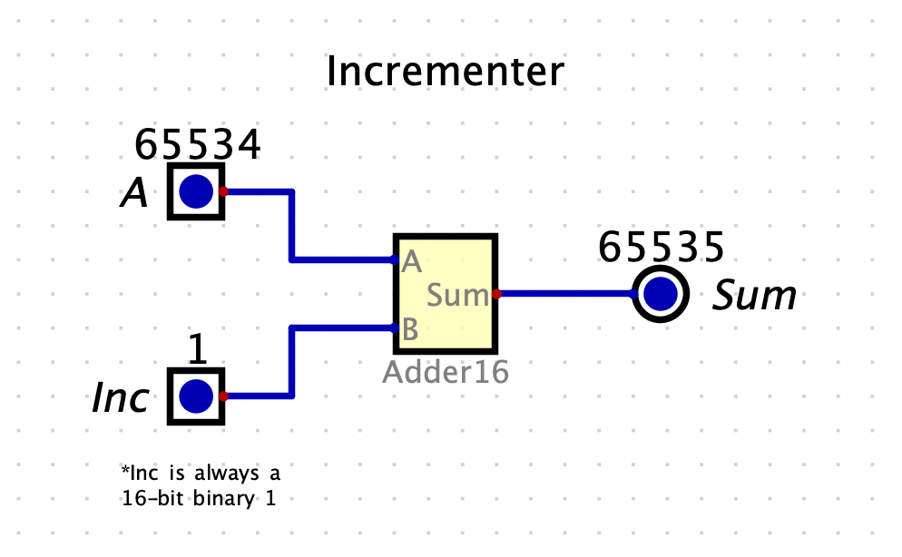
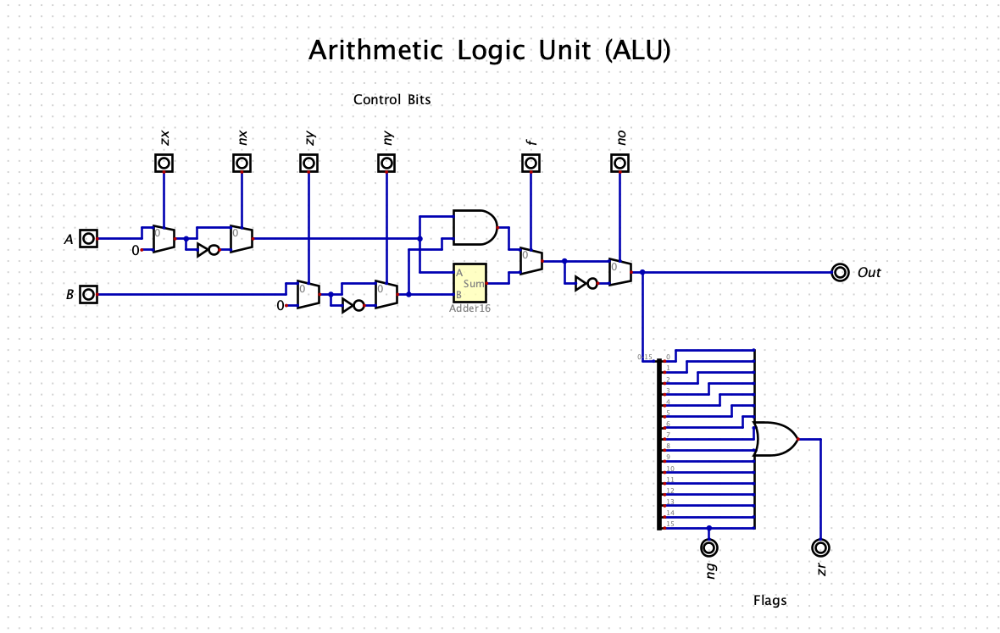

# Boolean Arithmetic

## HalfAdder
The **HalfAdder** chip is used to add binary digits and output a 2-bit number.

### HalfAdder Chip API
|Key|Value|
|---|---|
|Input| `a`, `b` |
|Output| `carry`, `sum` |
|Function| `sum = LSB of a + b, carry = MSB of a + b` |

### HalfAdder Truth Table
| A | B | Carry | Sum |
|---|---|---|---|
| 0 | 0 | 0 | 0 |
| 0 | 1 | 0 | 1 |
| 1 | 0 | 0 | 1 |
| 1 | 1 | 1 | 0 |

### HalfAdder Chip Diagram


## FullAdder
The **FullAdder** chip is designed to sum 3 bits, `a`, `b`, and `c`. This is a composite chip where this particular implementation is comprised of 2 **HalfAdder** chips and an **Or** chip.

### FullAdder Chip API
|Key|Value|
|---|---|
|Input| `a`, `b`, `c` |
|Output| `carry`, `sum` |
|Function| `sum = LSB of a + b + c, carry = MSB of a + b + c` |

### FullAdder Truth Table
| A | B | C | Carry | Sum |
|---|---|---|---|---|
| 0 | 0 | 0 | 0 | 0 |
| 0 | 0 | 1 | 0 | 1 |
| 1 | 0 | 0 | 0 | 1 |
| 0 | 1 | 1 | 1 | 0 |
| 1 | 0 | 0 | 0 | 1 |
| 1 | 0 | 1 | 1 | 0 |
| 1 | 1 | 0 | 1 | 0 |
| 1 | 1 | 1 | 1 | 1 |

### FullAdder Chip Diagram


## Adder (16-bit)
The **Adder** chip is designed to two 16-bit inputs, `a` and `b`. This is a composite chip where this particular implementation is comprised of 1 **HalfAdder** chip and 15 **FullAdder** chips, though there are a handful of other possible implementations.

### Adder Chip API
|Key|Value|
|---|---|
|Input| `a[16]`, `b[16]` |
|Output| `out[16]` |
|Function| `sum = a + b, overflow bit is ignored` |

### Adder Chip Diagram


## Incrementer (16-bit)
The **Incrementer** chip is designed to add `inc` (`1`) to a 16-bit input, `a`. In this example diagram, the input `inc` is always fixed to 16-bit binary representation of `1`.

### Incrementer Chip API
|Key|Value|
|---|---|
|Input| `a[16]`, `inc` |
|Output| `out[16]` |
|Function| `sum = a + inc (1), overflow bit is ignored` |

### Incrementer Chip Diagram


## Arithmetic Logic Unit (ALU)
The **ALU** chip is the computational centerpiece of the CPU. It is designed to take in two 16-bit inputs, `a` & `b` and then perform numerous arithmatic operations on the inputs and then returning the output `sum`

### ALU Chip API
|Key|Value|
|---|---|
|Input| `a[16]`,`b[16]`, `zx`, `nx`, `zy`, `ny`, `f`, `no` |
|Output| `out[16]`, `zr`, `ng` |
|Function| `if (zx) x = 0, if (nx) x = !x, if (zy) y = 0, if (ny) y = !y, if (f) out = x else out = x&y, if (no) out = !out, if (out == 0) zr = 1 else zr = 0, if (out < 0) ng = 1 else ng = 0`|

Additional ALU API Details:
```
zx: zero the a input
if (zx) x = 0 // 16-bit zero constant

nx: negate the a input
if (nx) x = !x // bit-wise negation

zy: zero the b input
if (zy) y = 0 // 16-bit zero constant

ny: negate the b input
if (ny) y = !y // bit-wise negation

f: if f == 1 out = add(x, y) else out = and(x, y)
if (f) out = x // integer two's complement addition
else out = x&y // bit-wise and

no: negate the out output
if (no) out = !out // bit-wise negation

zr: if (out == 0) zr = 1 else zr = 0
if (out == 0) zr = 1 else zr = 0 // 16-bit equality comparison

ng: if (out < 0) ng = 1 else ng = 0
if (out < 0) ng = 1 else ng = 0 // two's complement comparison
```

### ALU Truth Table
| zx | nx | zy | ny | f | no | out |
|---|---|---|---|---|---|---|
| 1 | 0 | 1 | 0 | 1 | 0 | 0 |
| 1 | 1 | 1 | 1 | 1 | 1 | 1 |
| 1 | 1 | 1 | 0 | 1 | 0 | -1 |
| 0 | 0 | 1 | 1 | 0 | 0 | x |
| 1 | 1 | 0 | 0 | 0 | 0 | y |
| 0 | 0 | 1 | 1 | 0 | 1 | !x |
| 1 | 1 | 0 | 0 | 0 | 1 | !y |
| 0 | 0 | 1 | 1 | 1 | 1 | -x |
| 1 | 1 | 0 | 0 | 1 | 1 | -y |
| 0 | 1 | 1 | 1 | 1 | 1 | x+1 |
| 1 | 1 | 0 | 0 | 1 | 0 | y-1 |
| 0 | 0 | 0 | 0 | 1 | 0 | x+y |
| 0 | 0 | 0 | 1 | 1 | 1 | y-x |
| 0 | 0 | 0 | 0 | 0 | 0 | x&y |
| 0 | 1 | 0 | 1 | 0 | 1 | x or y |
### ALU Chip Diagram


