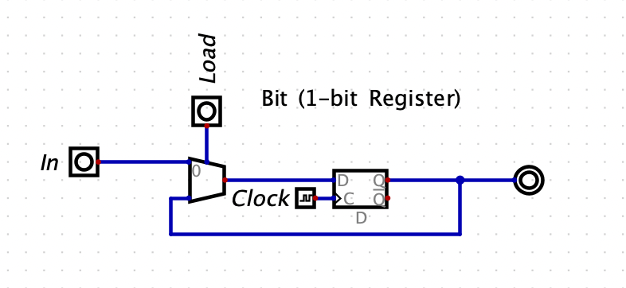
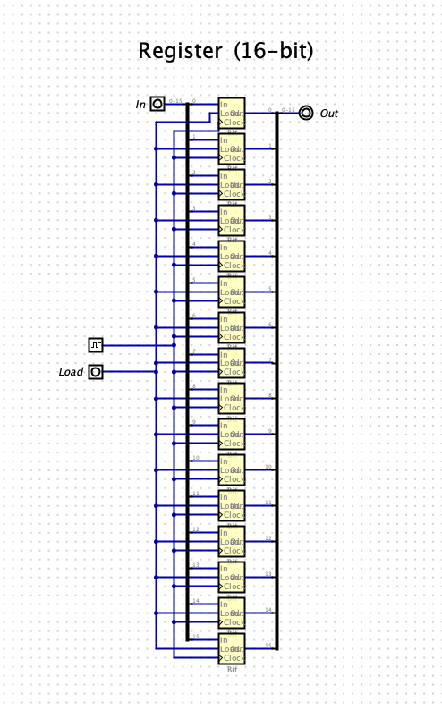
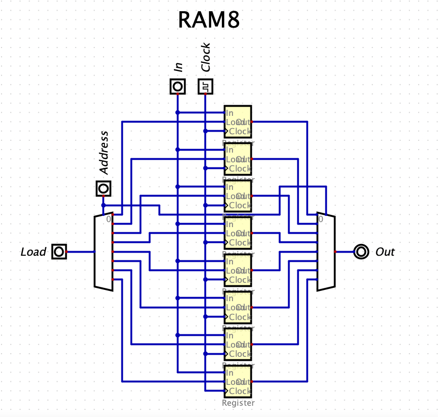

# Memory

## Bit
The **Bit** chip a.k.a the 1-bit **Register** is designed to hold a 1-bit value, `0` or `1`, over time. If the `load` bit is present, then
the output will equal whatever the value of `in` is after the current clock cycle, otherwise `out` remains the same.

### Bit Chip API
|Key|Value|
|---|---|
|Input| `in`, `load` |
|Output| `out` |
|Function| `if load(t) then out(t+1) = in(t) else out(t+1) = out(t)` |

### Bit Chip Diagram

## Register
The **Register** chip behaves the same way as the **Bit** chip, except that the register is designed to handle 16-bit values.

### Register Chip API
|Key|Value|
|---|---|
|Input| `in[16]`, `load` |
|Output| `out[16]` |
|Function| `if load(t) then out(t+1) = in(t) else out(t+1) = out(t)` |

### Register Chip Diagram

## RAM8
The **RAM8** chip consists of 8 16-bit **Register** chips that can be selected and manipulated separately. It's important for any RAM chip implementation to ensure access to a value at a given memory address is near-instantaneous.

### RAM8 Chip API
|Key|Value|
|---|---|
|Input| `in[16]`, `load`, `address[k] (k=log2^n)`|
|Output| `out[16]` |
|Function| `if (load == 1) RAM[address] = in else out = RAM[address]` |

### RAM8 Chip Diagram

