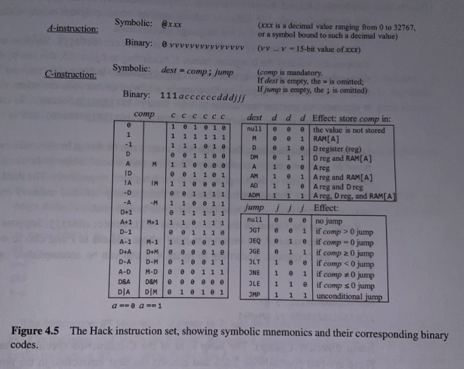

# Machine Language

"Machine language is the most profound interface in the computer enterprise -- the fine line where hardware meets
software. This is the point where the abstract designs of humans, as manifested in high-level programs, are finally
reduced to physical operations performed in silicon."

Machine languages are designed to manipulate `memory` using a `processor` and a set of `registers`.

## Memory

A continuous sequence of memory `registers`, each having a unique memory `address` that are used to store data and
instructions. Individual memory registers are accessed via their respective memory address.

## Processor

Also referred to as the `Central Processing Unit` or `CPU`, which is a hardware device capable of perfomring a fixed set
of primitive operations such as arithmetic and logical operations, memory acess operations, and control/branching
operations. The processor uses inputs from the selected memory registers and memory locations and outputs to selected
memory locations and memory registers. A `CPU` largely consists of an `ALU`, a set of registers, and gate logic used to
parse binary instructions.

## Registers

Processors and memory are implemented as separate, standalone chips, and moving data between the chips is relatively
slow. Because of this, processors are generally equipped with a number of on-board registers that are each capable of
holding a single value. These registers serve as high-speed, local memory for the processor so that data can be
manipulated without needing to venture outside of the chip.

### Data Register

A CPU-resident register that is designed to hold data values.

### Address Register

A CPU-resident register that is designed to hold data that can be interpreted as data values or as memory addresses.

### Instruction Register

A CPU-resident register that is designed to hold the instruction currently being executed.

## Languages

Machine language is genrally written in two (equivalent) ways -- `binary` & `symbolic`.

### Binary Language

Imagine the basic instruction: `set R1 to the value of R1 + R2`. Hypothetically, in binary, this could be represented as
such:

- the addition operation is `101011`
- register 1 is `00001`
- register 2 is `00010`

- And thus, the entire instruction in binary might be: `1010110001000001`, essentially the 3 binary representations
  combined like so: `101011|00010|00001`

In the early days of computing, computers were programmed manually, and instructions like the one above were often error
prone and difficult to debug.

### Symbolic Language

Due to the tediousness of raw binary instructions like the example above, programmers would often represent instructions
like `101011` as symbols such as `add` on paper before entering them into the machine. It didn't take long for computer
scientists to generate an agreed upon set of symbols that would map to their respective binary codes. This introduced a
new abstraction layer that allowed programmers to write and debug programs faster.

Symbolic machine languages are referred to as `assembly languages` and the programs that translate them into their raw
binary form are called `assemblers`. The syntax of assembly languages is tightly related to the low-level details of the
target hardware -- such as the available ALU operations, number and type of registers, memory size, and more.

## Instructions

## Arithmetic and Logic Operations

Every machine language includes instructions for perfomring basic arithmetic operations such as addition and subtraction
as well as basic logic operations such as `And`, `Or`, and `Not` for example.

### Arithmetic Operation Example:

```
// add two numbers
load R1,17 // loads the value 17 into R1 (register 1)
load R2,4 // loads the value 4 into R2 (register 2)
add R1,R1,R2 // loads the value of R1 + R2 into R1
```

### Logical Operation Example:

```
// add two numbers
load R1,true // loads the value true into R1 (register 1)
load R2,false // loads the value false into R2 (register 2)
and R1,R1,R2 // loads the result of a bit-wise And of R1 and R2 into R1
```

## Memory Access

All machine language offer a means by which to access and manipulate values stored at a given memory location. Memory
access is generally done via an address register.

## Flow Control

Generally machine language instructions are executed sequentially -- one instruction after the next, but there are also
occassional `jumps` where something other than the immediate next instruction is executed. To facilitate this
conditional mechanism, machine languages feature several variants of conditional and uncondtional `goto` instructions.

### Conditional Branching

Flow control that checks if a condition is met before proceeding to the `jump` or `goto` instruction.

### Unconditional Branching

Flow control that occurs without any conditions such as a `goto` instruction, such as the `goto` instruction at the end
of a for-loop.

## Symbols

Unlike code that uses physical memory addresses (hard-coded), assembly code (which uses symbolic references) can be ran
from any segment in memory. Code that mentions no physical addresses is said to be `relocatable`.

## Hack Language Specification



### The `A` Instruction

Sets the `A` register to an arbitrary 15-bit value. The complete binary version of the `A` instruction consists of two
fields: an operation code (`op-code`), which is `0` (the left-most bit), followed by 15 bits which represent a
non-negative binary number.

For example, the symbolic instruction `@5` represents `0000000000000101`.

The `A` instruction serves three primary purposes:

1. It provides the only way to enter a constant into the computer under program control
2. It sets the stage for a subsequent `C` instruction that manipulates a selected RAM register, reffered to as `M`, by
   first setting `A` to the address of that register.
3. It sets the stage for a subsequent `C` instruction that specifies a `jump` by first setting `A` to the address of
   the `jump` destination.

### The `C` Instruction

Answers three primary questions:

1. What to compute (an `ALU` operation, denoted as `comp`)
2. Where to store the computed value (denoted as `dest`)
3. What to do next (denoted as `jump`)

The complete binary version of the `C` instruction has it's left-most bit, it's `op-code`, set to `1`. The next two bits
are not used, but by convention, are set to `1`. The next seven bits are the binary representation of the `comp` field, the next three bits are the binary representation of the `dest` field, and lastly, the final and right-most 3 bits are the binary representation of the `jump` field.

Syntax Example: `op-code|arbitrary bits|comp|dest|jump`

#### Computation Specification (`comp`)


#### Destination Specification (`dest`)

#### Jump Directive (`jump`)